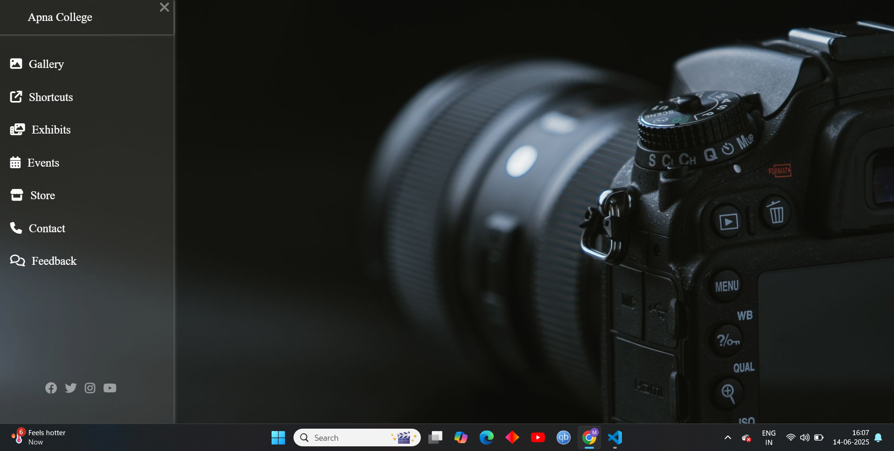

# 🚀 pure-html-css-site

> A fully responsive website built using **only HTML and CSS** — no JavaScript used at all.

## 💡 About the Project

This project was created as a **challenge** to build a complete and visually appealing website **without using a single line of JavaScript**.  
No libraries, no frameworks, no scripts — just the raw power of **HTML5 and CSS3**!

It's a fun experiment to explore what modern CSS is capable of on its own.

## 🎯 Features

- Fully responsive layout 📱💻
- No JavaScript – 100% HTML + CSS 🧼
- Clean and structured code 🧠
- Minimalist and modern design ✨

## 🛠️ Built With

- HTML5
- CSS3 (Flexbox, Grid, Media Queries)

## 🧪 Challenge

I challenge **YOU** (yes, you reading this) to recreate or build your own cool website **without using JavaScript**.  
Once you're done, **drop your version in the comments** of my [LinkedIn post](#) or fork this repo and submit a pull request!

Let’s test who’s got the real frontend muscle 💪🔥

## 📸 Preview




## 📂 Folder Structure

```bash
/
├── index.html
└── style.css
